# BlobEcoleElementaire
Initiation à la démarche scientifique avec travaux pratique sur le blob. Séances effectuées en CM1 et CM2.

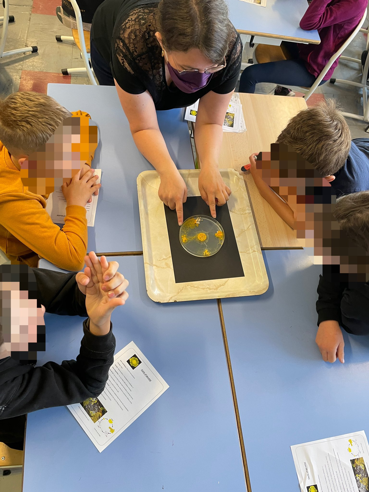

> Auteurs : Morgane Thomas-Chollier (ENS-PSL), Benjamin Bardiaux (CNRS)  
> Créé le : 17/03/2023  
> Dernière version : 2023-03-26 v1.0  
> Licence : CC BY-NC 4.0  
> Comment le citer : Thomas-Chollier, Bardiaux. 2023. BlobEcoleElementaire. https://github.com/morganeTC/BlobEcoleElementaire.  
> Séances effectuées à : Ecole élémentaire Velpeau, Antony, France.
> 
> Nous remercions chaleureusement les enseignantes qui nous ont fait confiance pour monter ces deux ateliers dans leurs classes.

**Liens rapides:**
 - [Objectif et déroulement](#item-one)
 - [Matériel](#item-two)
 - [Réveil des blobs](#item-three)
 - [Séance 1](#item-four)
 - [Séance 2](#item-five)

## Objectif et déroulement 

Ce document permet de reproduire deux types de séances:
* première découverte du blob (niveau CM1-CM2)
* mesure expérimentale du périmètre et de l'aire du blob (niveau CM2)

Les deux séances ont en commun la découverte du blob et de la recherche en biologie :
* le blob est un organisme vivant dans son milieu naturel
* le blob est étudiable en laboratoire, dans un milieu reproductible 
* présentation de l'expérience de sciences participative du CNRS "« Derrière le blob, la recherche ». 

**La séance 1** a pour objectif de découvrir la démarche scientifique. 

* poser une question relative à l'effet de substances sur le blob
* mettre en place un protocole expérimental simple pour répondre à cette question
* mettre en place une expérience contrôle
* observer la reaction/croissance du blob vis-à-vis de la substance
* comparer à l'experience contrôle et en tirer des conclusions

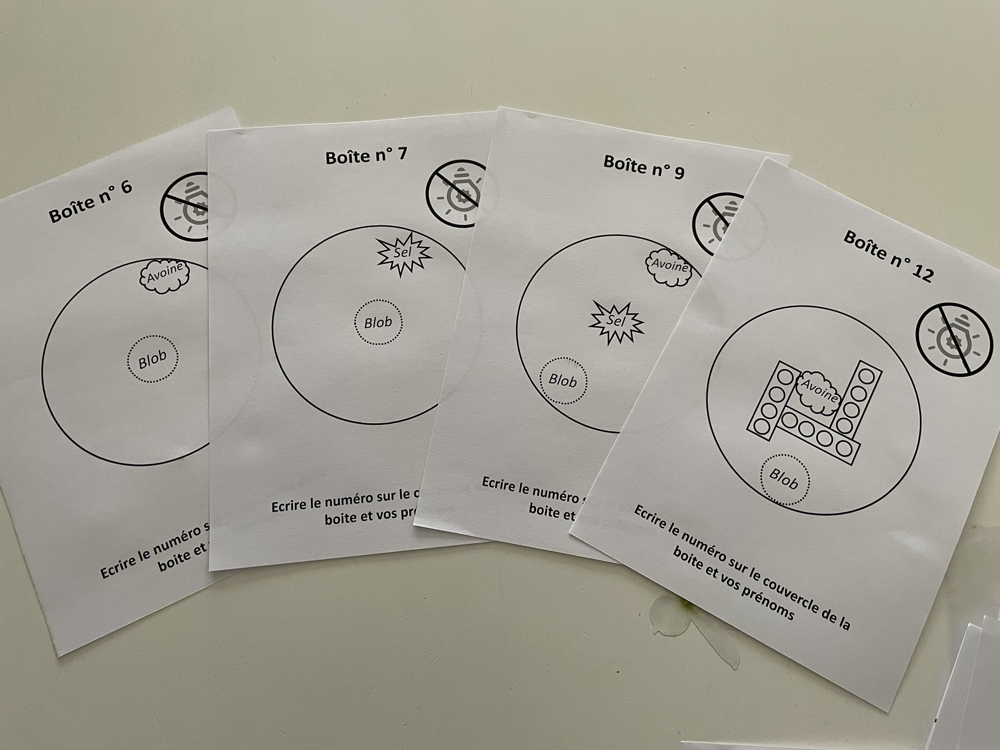

**La séance 2** a pour objectif de découvrir la notion de mesure quantitative pour comparer différentes conditions expérimentales. 

* obtention de la donnée expérimentale (photo de blob avec règle)
* mesure du périmètre/aire du blob via un site web dédié
* ordonner les blobs selon leur périmètre
* associer les blobs à leur condition de culture
* tirer des conclusions

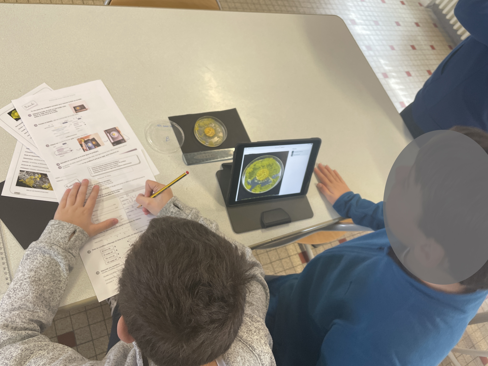

Chaque séance dure 1h15. La  séance 2 peut avoir une partie commune plus courte pour laisser plus de temps à la pratique.
La séance 1 est prévue pour 30 élèves (15 binômes), avec une version des documents adaptée pour 6 binômes.
La séance 2 est prévue pour 14 élèves (7 binômes).

### Pas encore familier avec le blob et son élevage ?
Voir la fiche [Comment élever son blob à la maison](documents/8-Elever_blob.pdf).

La courte vidéo par Audrey Dussutour (CNRS) est ici: [https://www.youtube.com/watch?v=uyVVknT0gpY](https://www.youtube.com/watch?v=uyVVknT0gpY)

## Matériel 

### Matériel pour élever les blobs, en amont de la séance
* sclérotes (blob séché) ou blob déjà réveillé
* boîtes de Petri
* agar-agar (en grandes surfaces ou magasin bio)
* flocons d'avoine (en grandes surfaces ou magasin de vrac, éviter les bio)
* bouchon de bouteille d'eau ou de soda 
* boite en carton (qui constituera la "blobhouse")
* couteau (en plastique)
* stylos de type feutre permanents fins pour écrire sur les boîtes
* eau de Javel pour nettoyer les boîtes
* sel (pour préparer la séance 2)
* optionel : thermomètre

### A imprimer
Les documents sont accessibles [ici](documents_a_imprimer).

#### commun aux 2 séances
* document "1-Carte identité" en 15 exemplaires (2 par page A4 pour distribuer des formats A5 aux élèves)

#### séance 1
* document "2-Listes_boites" en 1 exemplaire enseignant
* document "3-Conditions_boites" en 1 exemplaire enseignant
* document "4-Schema_boîtes" en 1 exemplaire (format A5)
* document "7-Guide_pour_lire_les_résultats" en 1 exemplaire enseignant

#### séance 2
* document "3ter-Conditions_boites_explo" en 1 exemplaire enseignant
* document "6-CM2_fiche" en 14 exemplaires A4
* document "9-protocole_CM2" en 7 exemplaires A4

### Matériel pour les séances

#### commun aux 2 séances
* Un diaporama présentant le Blob et l'experience participative "Derrière le Blob, la recherche". Un exemple de diaporama se trouve dans la section [documents/](documents/)
* idéalement, prévoir un tableau de type TNI ou un videoprojecteur pour diffuser le diaporama. A défaut, la présentation du blob peut se faire à l'oral sans support visuel.
* 1 boîte en carton (qui constituera la blobhouse)

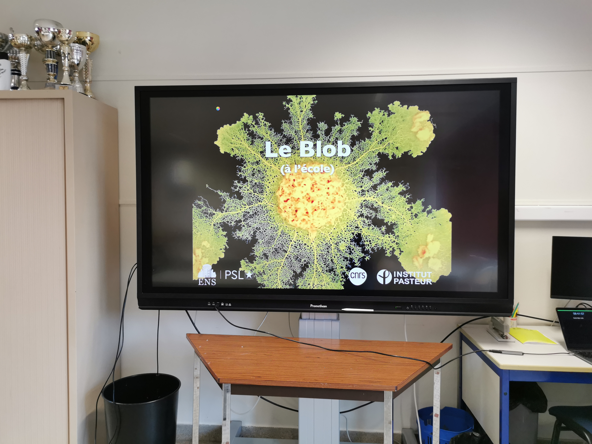

### Séance 1
* feutres permanents fins (pour écrire sur les boîtes de Petri)
* boîtes de Petri avec gélose déjà coulée (15 boites dont 2 labyrinthes en lego + 1 de démo)
* boîtes avec blobs qui couvre la boîte (5 boites + 1 au cas où)
* couteaux ou cuillères en bambou ou plastique pour couper le blob
* sac en plastique ou récipient pour stocker les couteaux après utilisation
* dans de petits contenants : avoine, chocolat, sel
* petites cuillères pour se servir dans les contenants
* optionnel (mais pratique) : plateaux
* optionnel : feuille noir et loupe
* optionnel : sclérotes
* optionnel : mouchoirs

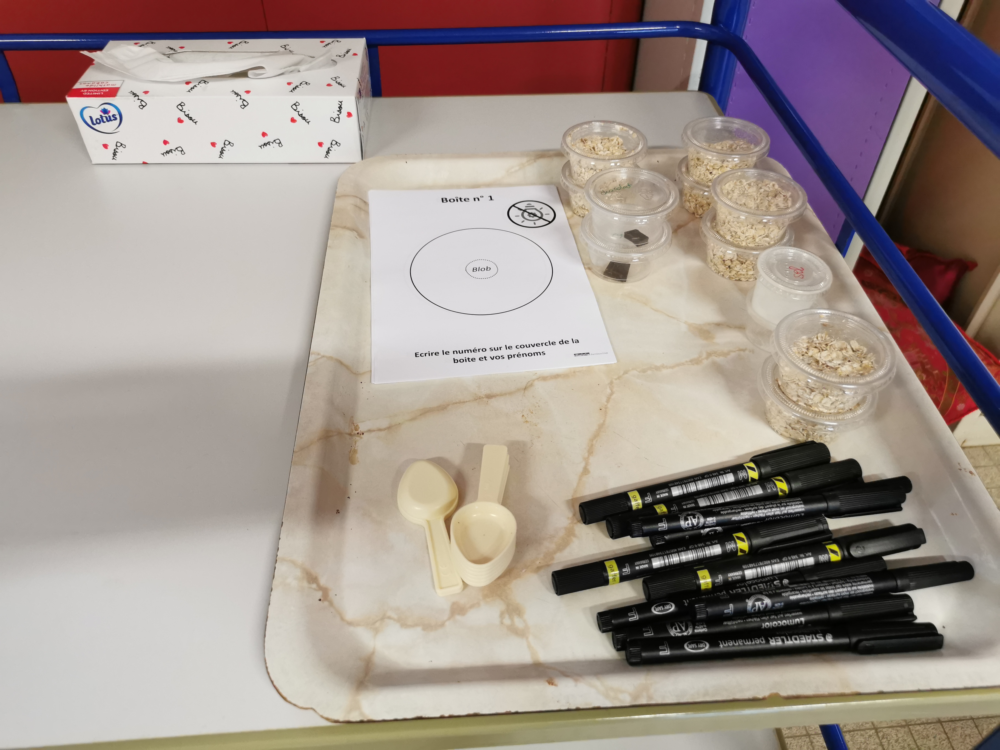
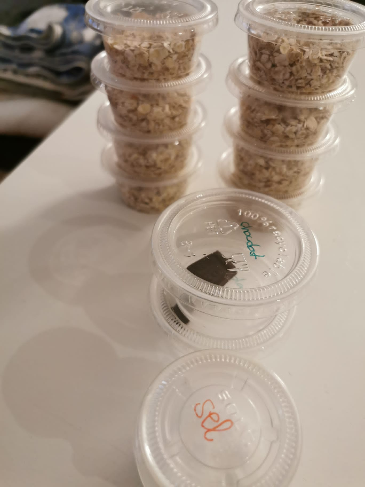
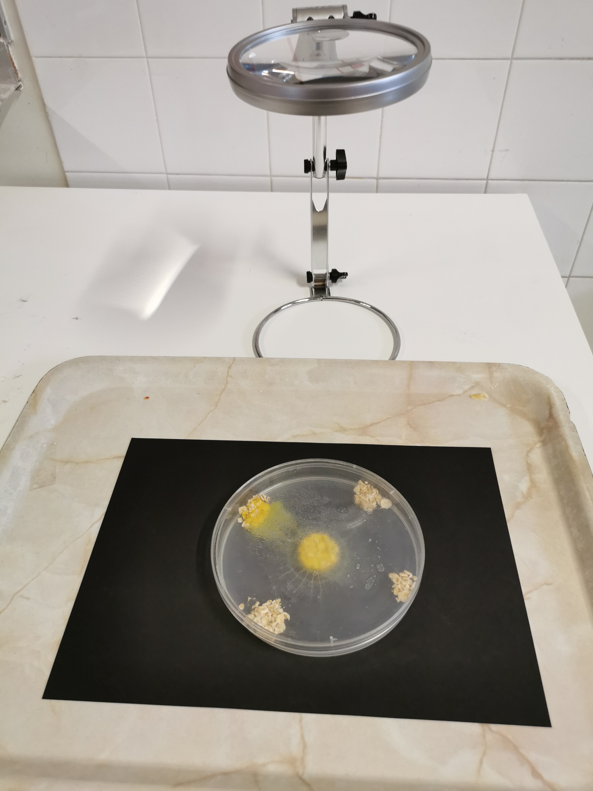

### Séance 2
* tablettes tactiles
* règle graduée des élèves
* stylos des élèves
* feuilles noires, 7 au format A5

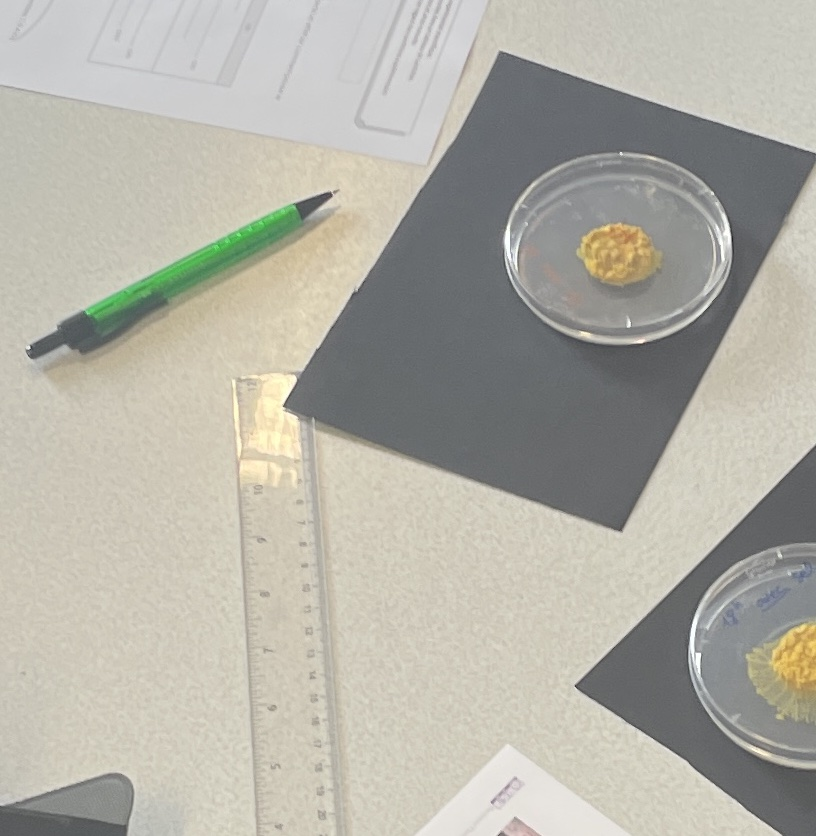
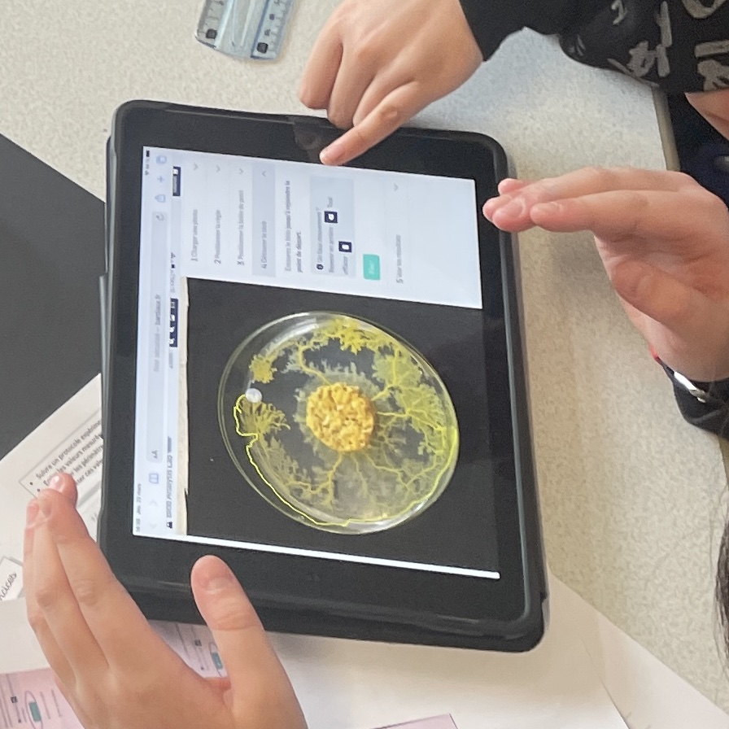

## Réveil des blobs
Cette partie est à réaliser si le blob est sous forme de sclérote. Sinon, aller à la fin de section et suivre les instructions **croissance du blob**.

* 15 jours avant la séance, réveiller les sclérotes
* Pour cela il faut préparer le lieu de vie du blob (= "couler des boîtes"). Pour préparer ce fond de gélose à couler dans la boîte :
	-	Mettre 2g d’agar-agar (en général cela correspond à un sachet) dans 250 mL d’eau froide dans une casserole
	-	Porter à ébullition
	-	Couler dans les boites (environ 10) pour avoir une hauteur d'environ 3 mm (soit une petite louche)
	-	Remettre le couvercle
	-	Après 15 min de refroidissement, la gélose sera devenue solide. Mettre les boîtes au réfrigérateur. Elles se gardent 5 jours au réfrigérateur (sans blob dessus).

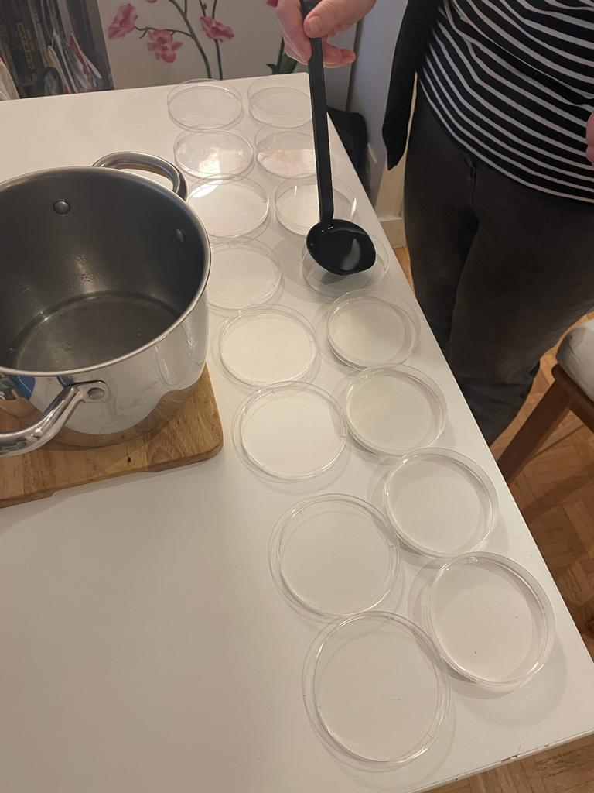
	
* Entamer le réveil des blobs en suivant ce protocole video jusqu'à 3min20 (ne pas tenir compte des aspects Experimental et Contrôle, préparer 4 à 6 boîtes en anticipant que certains sclérotes ne se réveilleront pas) : https://www.youtube.com/watch?v=OM3cuu0WrZo

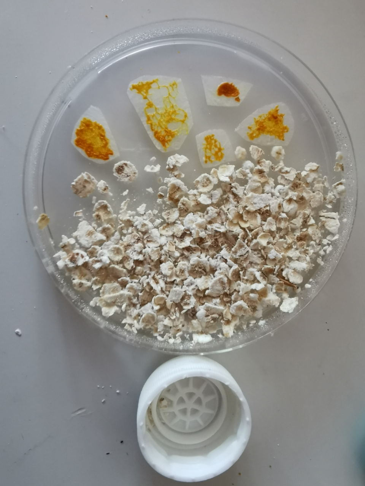

* Placer les boites dans la blobhouse, à l'abri de la lumière et dans un endroit avec une température clémente (22° à 25°, notre souche s'est réveillée plus rapidement à vers 24° que vers 21-22°)

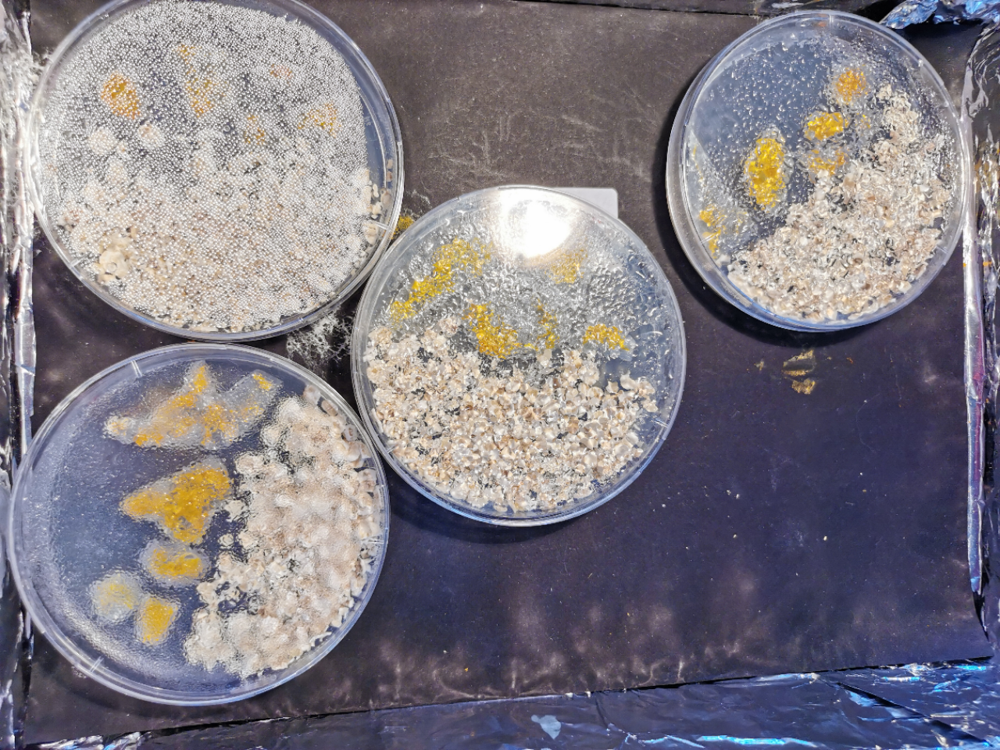

* Le lendemain (ou le surlendemain si le blob n'a pas encore envahi toute l'avoine), poursuivre avec la phase de **croissance du blob** et augmentation du nombre de boîte (vidéo à partir de 3min20) : https://www.youtube.com/watch?v=OM3cuu0WrZo

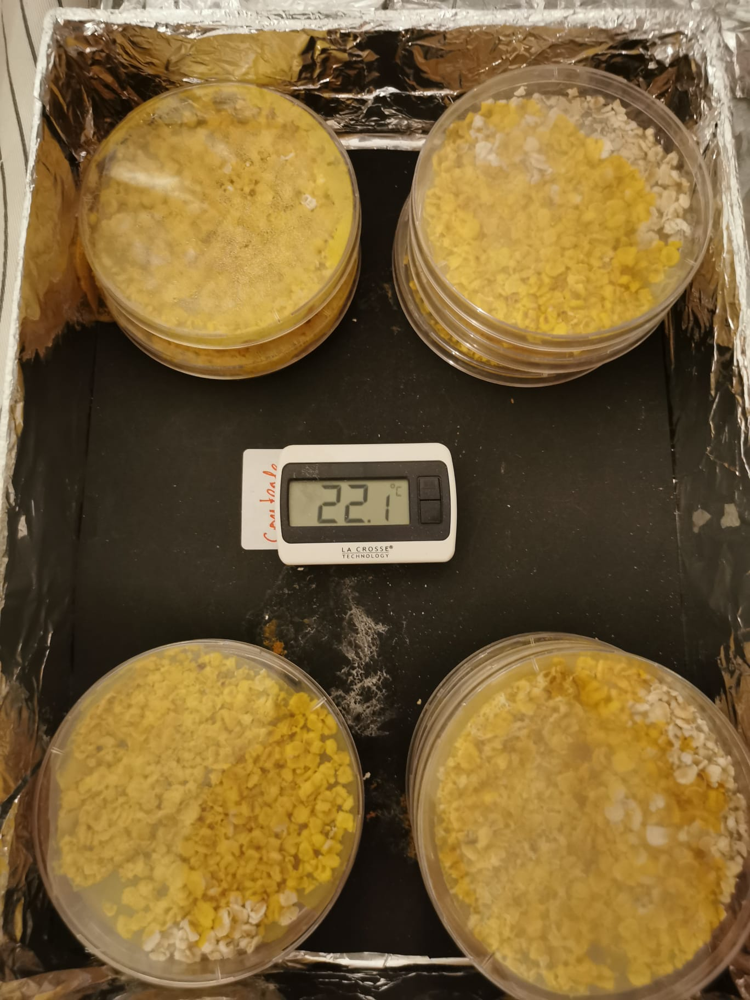

* Les boîtes peuvent être réutilisées après nettoyage à l'eau de Javel.

Des questions ? [la FAQ du CNRS](https://www.cnrs.fr/sites/default/files/download-file/BlobCNRS_FAQ_1.pdf)

# Séance 1

## Obtenir les boîtes de blob pour la séance 1
Nous prévoyons 6 boîtes de blobs pour la séance, et 2 boîtes à garder (non utilisées pour la séance, afin de conserver le blob). Optionnel : un blob en "exploration" (joli à observer, voir la séance 2 pour les instructions à suivre).

Transférer et nourrir les blobs sur une nouvelle boîte le soir précédent la séance, afin que le blob aie recouvert toute la boîte pour la séance.

## Préparer les boîtes de gélose pour la séance 1
* préparer 14 boîtes
* préparer 2 labyrinthes en utilisant des legos (3 briques). Utiliser un verre pour tenir les legos pendant le coulage des boîtes.

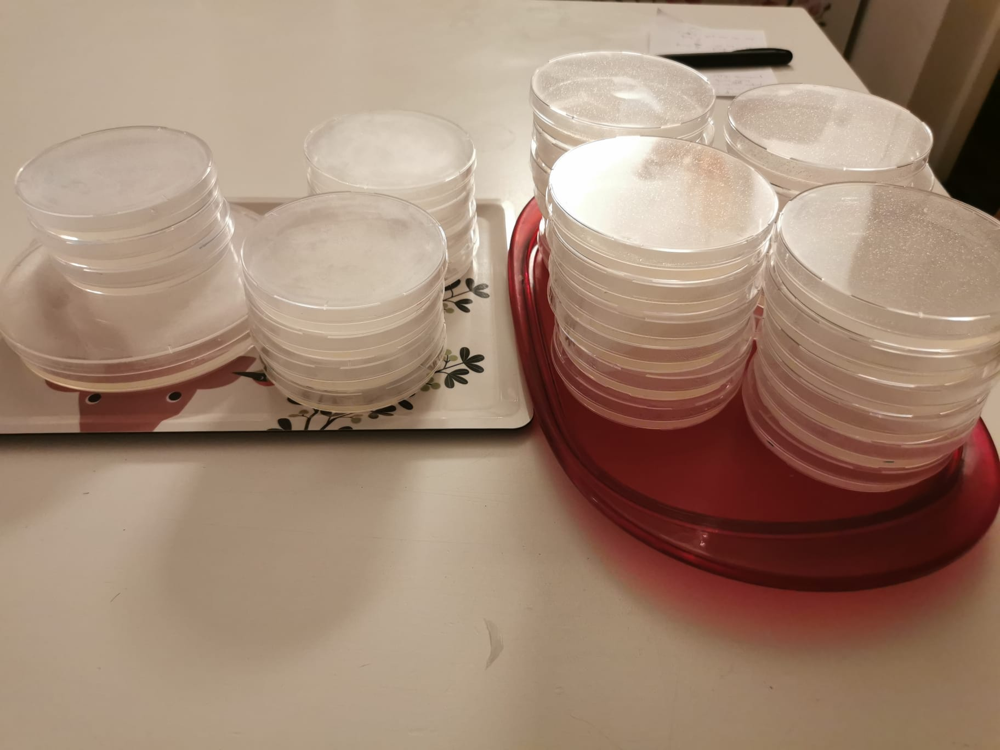
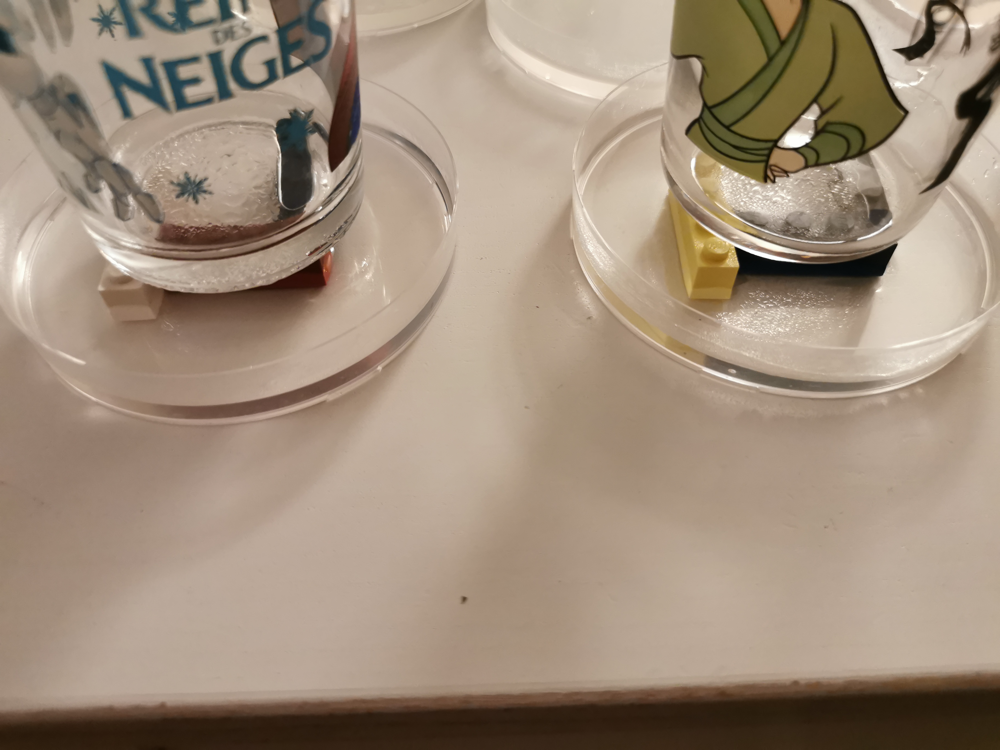

## Déroulement de la séance 1

### Partie commune avec la séance 2
* présentation avec le diaporama (30min environ) ou présentation orale sans support 
* distribuer le document *carte d'identité du blob*
* les élèves peuvent lire ce document pendant que se met en place la suite.

### Partie spécifique à la séance 1
* Passer au sein de petits groupes pour montrer un blob, une boite avec de la gelose et (si possible) un sclérote. Bien expliquer que la gélose permet de "capturer" l'eau et se servir de la boite sans blob pour qu'ils visualisent bien la gélose. Expliquer que le blob est jaune et sur l'avoine.

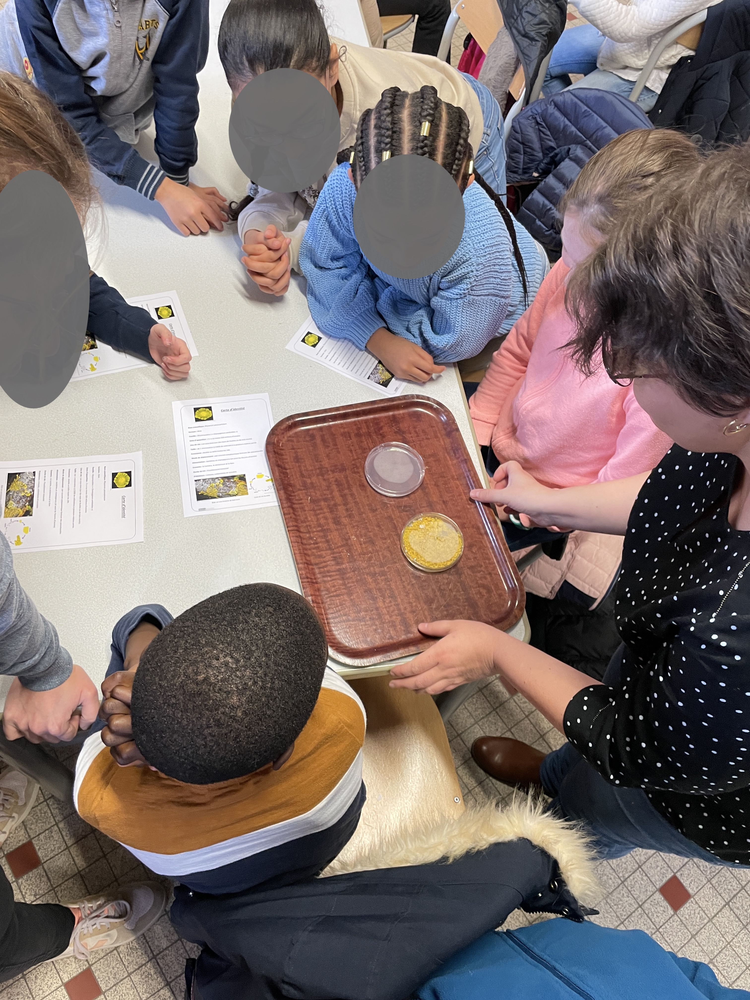

* Distribuer aux binômes : 1 boite avec gélose, un feutre, une des fiches *4-Schema_boîtes*. Leur demander d'écrire leurs prénoms sur la boîte ainsi que le n° de la boîte, indiquée en haut sur le schéma.

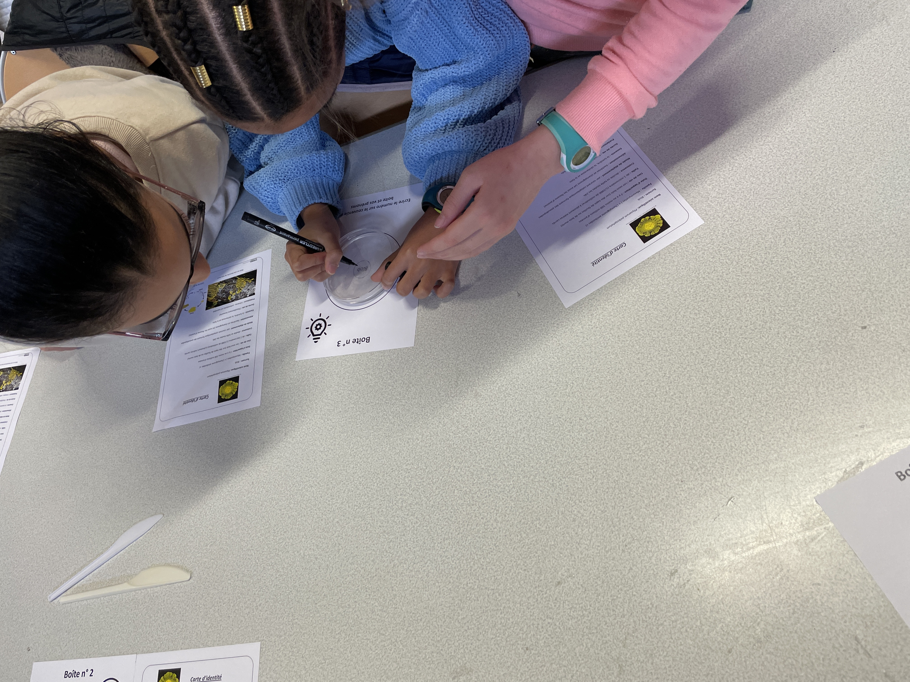

* Récupérer les feutres.
* Distribuer aux binômes : 1 couteau/cuillère,  le matériel correspondant à la fiche (avoine, sel, chocolat) prévoir une cuillère ou un bouchon pour servir l'avoine.
* Expliquer aux binômes comment utiliser le schéma de leur boîte pour réaliser l'expérience.
* Distribuer les blobs et laisser les élèves préparer leur boîte.

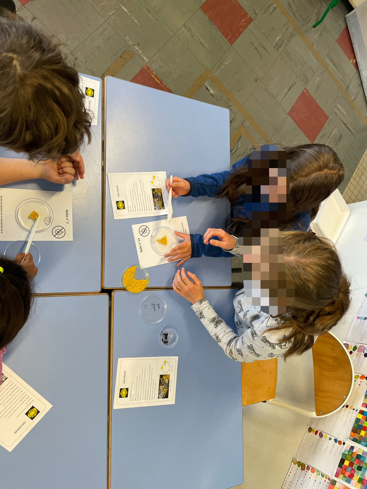

* Vérifier que les boîtes sont correctes par rapport au schéma, et fermées avec leur couvercle. Récupérer le matériel restant. Déposer les couteaux/cuillères qui ont été en contact avec le blob dans un sac séparé, afin de les laver ultérieurement à l'eau de Javel.
* Demander aux enfants d'apporter leur boîte à la blobhouse, et fermer la blobhouse. Attention, deux boîtes devront rester à la lumière, donc en dehors de la blobhouse.

* Indiquer le prénom des élèves sur la fiche *2-Liste_boites* pour centraliser l'association n°boîtes et élèves.
* Expliquer aux élèves comment les boîtes seront utilisées et comparées (notion de contrôle) en leur présentant oralement la fiche *3-Conditions_boites*. Si manque de temps, cette étape peut se faire plus tard lors de l'observation des blobs.
* Laisser croître les blobs quelques heures et faire une première observation.
* Le lendemain (au bout de 24h), observer de nouveau les blobs. Utiliser la fiche *7-Guide_pour_lire_les_résultats* pour bien interpréter les boîtes et utiliser le bon vocabulaire.

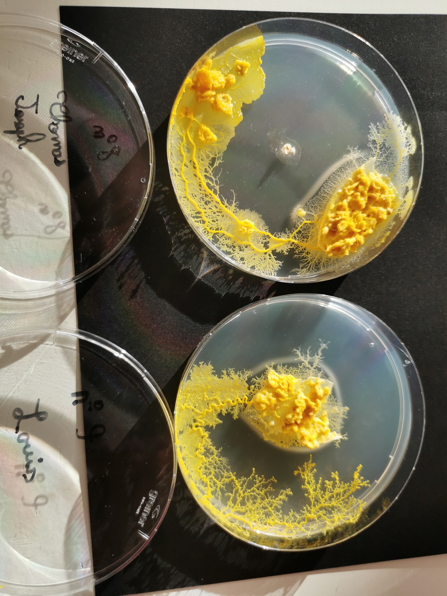
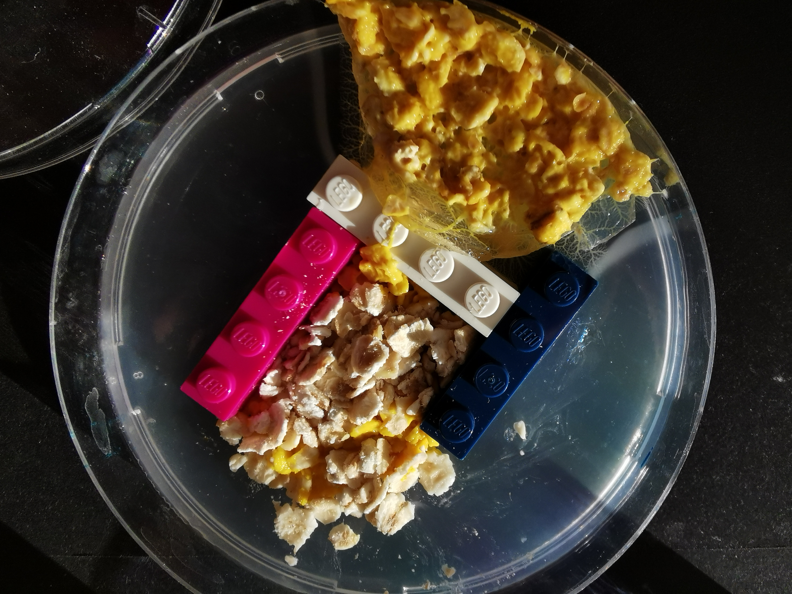
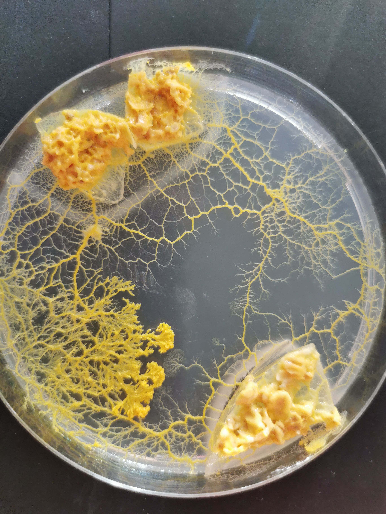

### Comment se débarrasser du blob ?
Vous pouvez en faire don, le jeter ou le rendormir. Voir les explications sur cette vidéo (à 9min46) : [vidéo](https://www.youtube.com/watch?v=uyVVknT0gpY)

# Séance 2

## Obtenir les boîtes de blob pour la séance 2 (boîtes "exploration")
* Préparer à l'avance 8 boîtes avec gélose
* Prévoir 2 boîtes de blob

18h avant la séance, préparer 4 boîtes "exploration" à partir d'une boîte de blob:

* à l'aide du bouchon extraire 4 ronds de blob
* les déposer bien au centre de chaque boîte avec gélose
* Sur 2 boîtes, déposer du sel près du bord sur le pourtour de la boîte
* refermer la boîte 
* Noter au feutre la lettre de la boîte et sa condition (par exemple "18h sans sel". Utiliser le document *3ter-Conditions_boites_explo* pour connaître la lettre de la boîte.
* remettre les boîtes dans la blobhouse

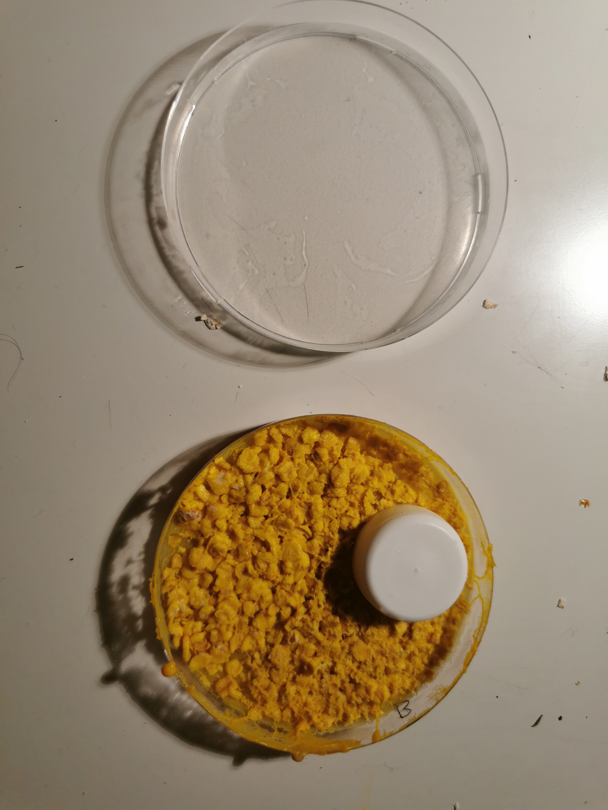
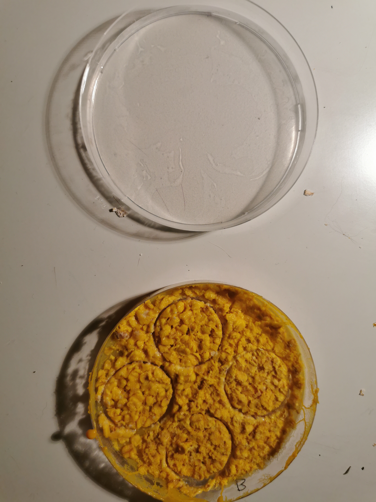
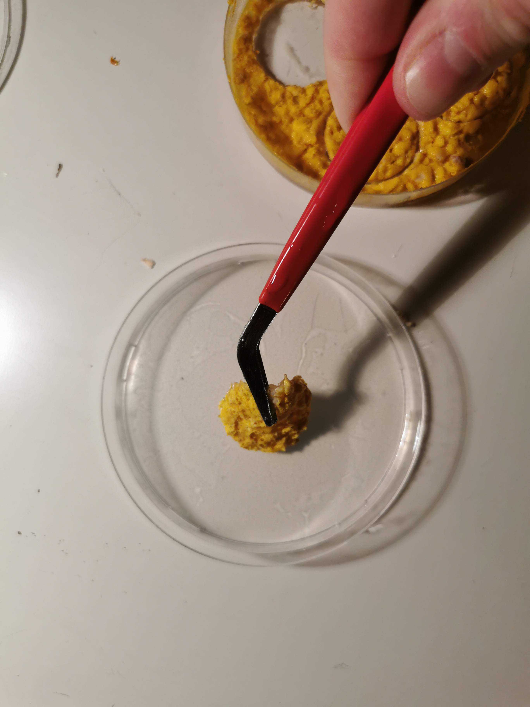
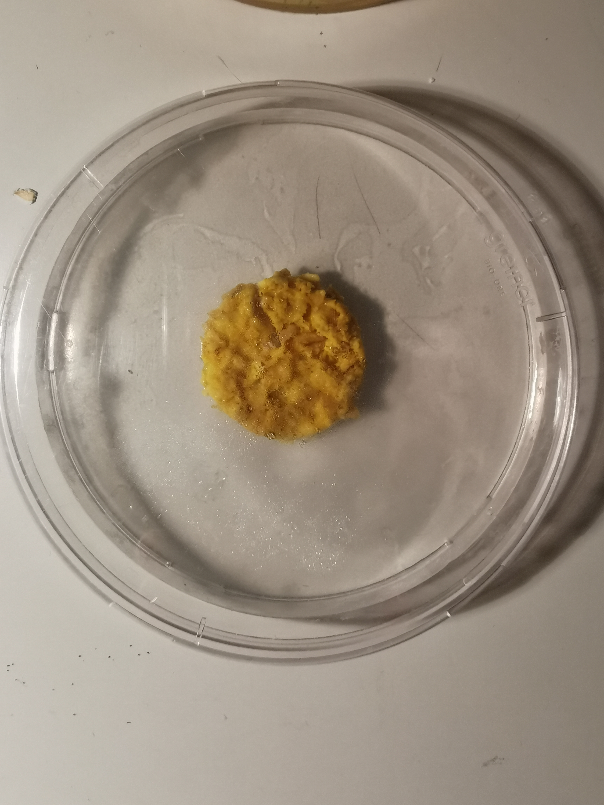
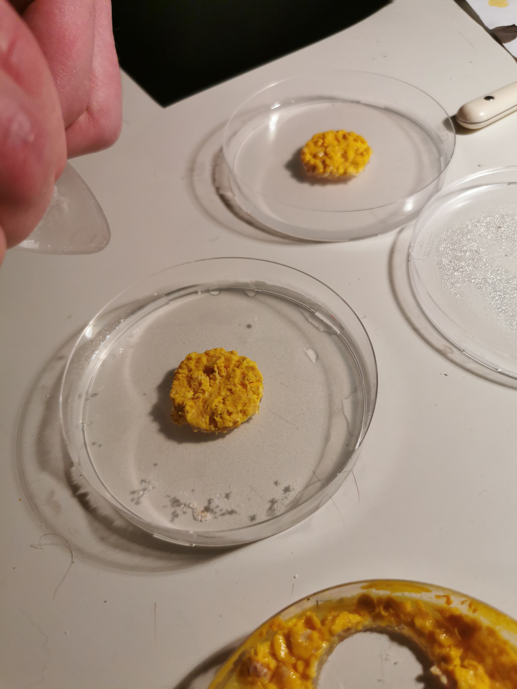

6h avant la séance, préparer 4 autres boîtes "exploration" à partir du second blob, en suivant les mêmes étapes.

La séance 2 a donc 8 boîtes "exploration", préparées à des temps différents. Si besoin, les temps peuvent être adaptés en fonction de l'heure prévue pour la séance (ici, la séance avait lieu à 14h).

## Préparer les tablettes
* sortir 7 tablettes et s'assurer qu'elles sont chargées et connectées à internet (éventuellement, prévoir une connection partagée via un téléphone en 4G).
* Sur chaque tablette, ouvrir un navigateur web et entrer l'adresse du site web prévu pour l'analyse.

> Nous avons utilisé [http://blob.bardiaux.fr](http://blob.bardiaux.fr) mais vous pouvez l'installer sur votre propre serveur en installant le site à partir des fichiers dans [page_web_analyse/](page_web_analyse/).

## Déroulement de la séance 2

### Partie commune avec la séance 1
=> cette partie est à réaliser si les élèves ont fait la séance 1 l'année précédente. Si les élèves font les séances 1 et 2 proche dans le temps, il n'est pas nécéssaire de répéter cette partie commune.
* présentation avec le diaporama (30min environ) ou présentation orale sans support 
* distribuer le document *carte d'identité du blob*
* les élèves peuvent lire ce document pendant que se met en place la suite.

### Partie spécifique à la séance 2
* Distribuer les documents *6-CM2_fiche* (1 par élève) et *9_protocole_CM2* (1 par binôme).
* Distribuer une tablette par binôme.
* Les élèves  peuvent suivre le protocole du document en autonomie, ou bien montrer aux élèves une première fois le protocole. :warning: Attention à bien disposer la règle !
* Les élèves vont remplir la fiche au fur et à mesure qu'ils prennent en photo 4 boîtes sur les 8.
* Les élèves terminent ensuite l'exercice de comparaison des valeurs mesurées.
