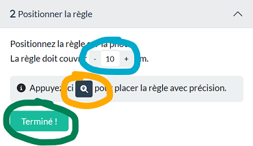

Cet outil a été initialement développé par [Laurent Knoll](https://github.com/verdi8) dans le cadre du projet de science participative [Derrière le blob, la recherche](https://www.cnrs.fr/fr/cnrsinfo/le-blob-et-la-demarche-scientifique) du CNRS. Les sources originales sur [GitHub](https://github.com/verdi8/blob-analysis-lab-demo).

Ce site est une ***adaptation*** de l'outil pour des séances en école élémentaire, avec la possibilité notamment d'utiliser des tablettes tactiles et d'obtenir facilement des mesures simples sur la croissance du blob (périmètre et aire). Une version en ligne est accessible ici [http://blob.bardiaux.fr]().

# Mode opératoire
## Présentation
**Cet outil vous accompagne**  - pas à pas - dans **l'analyse des photos de blobs**, afin de fournir les données nécessaires à l'apprentissage du _Machine Learning_. 

L'analyse se déroule en **5 étapes** :

[1. Charger une photo](#Étape-1-charger-une-photo)  
[2. Positionner la règle](#Étape-2-positioner-la-règle)  
[3. Positionner la boîte de Petri](#Étape-3-positionner-la-boîte-de-petri)  
[4. Détourer le blob à main levée](#Étape-4-détourer-le-blob)  
[5. Voir les résultats de mesures](#Étape-5-voir-les-résultats)  
[6. Télécharger les fichiers de mesures](#Étape-6-optionnel-télécharger-les-résultats)  

Chaque étape est décrite dans la partie droite du _lab_. Il est possible de revenir à tout moment
en arrière en cliquant sur le titre de l'étape.

C'est parti...

---

## Étape 1 : charger une photo

**Charger une photo** à analyser - située sur l'ordinateur - avec le **bouton "Parcourir..."**.

Une fois la photo chargée, **l'étape 2 est automatiquement activée**.

Mais avant...

> ### Comment zoomer et déplacer la photo
> Pour prendre les mesures avec le plus de précision, il est possible de :
> * **zoomer/dézoomer (agrandir/rétrécir) la photo** avec la molette de la souris
> * **déplacer la photo** : tout en appuyant sur la touche contrôle (le curseur devient des flèches), cliquer sur la photo et la déplacer avec la souris
> 
> La barre de boutons de zoom sur le haut de la page permet d'ajuster l'affichage :
> *  : agrandir la photo
> *  : rétrécir la photo
> *  : ajuster la photo à l'écran et la repositionner au centre (:sparkles: bien utile si l'on perd la photo de vue)
> *  : afficher la photo en taille réelle

Maintenant au travail !

---

## Étape 2 : positioner la règle
Cette étape permet au logiciel de déterminer l'échelle de la photo.

**Déplacer la ligne jaune à l'aide des 2 "poignées"** (petits carrés blancs sur ordinateur *ou* des ronds sur tablette) à chacune de ses extrémités afin de 
**couvrir 8cm de la règle**. 

Pour s'assurer que 8 centimètres sont bien couverts, **les petits points "détrompeurs" doivent tomber sur chaque centimètre**.

Si il y a moins de 8cm règle sur la photo, il est possible de modifier la taille à couvrir avec les boutons +/- (en bleu ci-dessous).
Le nombre de détrompeurs sera ajusté.

Pour placer la règle avec plus de précision, utiliser le bouton  (en jaune ci-dessous).

Une fois la règle placée, **passer à l'étape suivante en appuyant sur le bouton "Terminé !"** (en vert ci-dessus).

---

## Étape 3 : positionner la boîte de Petri

Tout comme la règle, **placer la boîte de Petri à l'aide des poignées**, et utiliser le bouton 
pour la placer avec précision.

>
>
> Au début on y va à tâtons, mais on prend vite le coup de main.
>
> 

Une fois la boîte de Petri correctement positionnée, **passer à l'étape suivante en appuyant sur "C'est fini !"**

---

## Étape 4 : détourer le blob

Lors de cette étape, **entourer d'une ligne jaune le blob** (dessiner en maintenant le bouton de la souris pressé).

>
> **Oh non !** Si près de la fin
>
> 
> 
> Il est possible de revenir en arrière sur les derniers points du tracé avec le bouton  
> 
> 
>

Lorsque l'on a rejoint le point de départ marqué par un carré blanc, **le contour est terminé et colorié en jaune**.

Le bouton   s'active et permet de **passer à l'étape suivante**.

---

## Étape 5 : voir les résultats

Les ***mesures du périmètre et de l'aire*** du blob détouré s'affiche alors. Les élèves peuvent alors les noter.
 
Le bouton ***Plus de résultats*** permet d'afficher les fichiers d'analyse à télécharger si on veut aller plus loin.

---

## Étape 6 (optionnel): télécharger les résultats

**Télécharger les fichiers un à un** avec .

Les fichiers sont stockés dans le répertoire "Téléchargements" du navigateur.  

